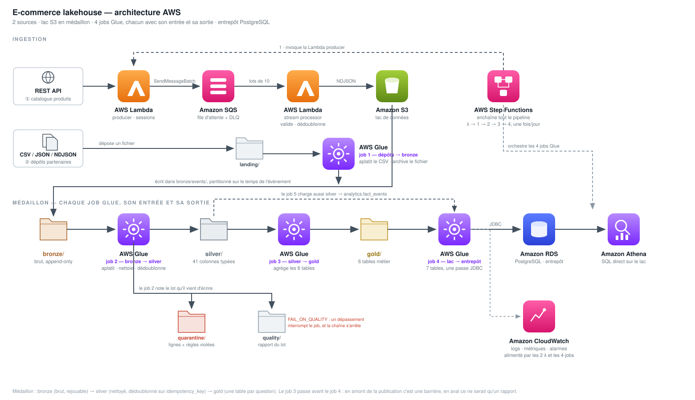
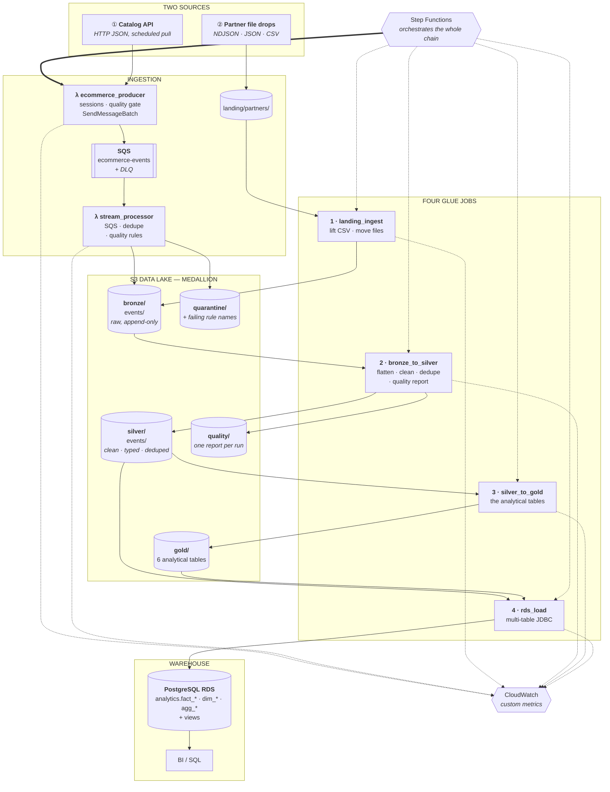
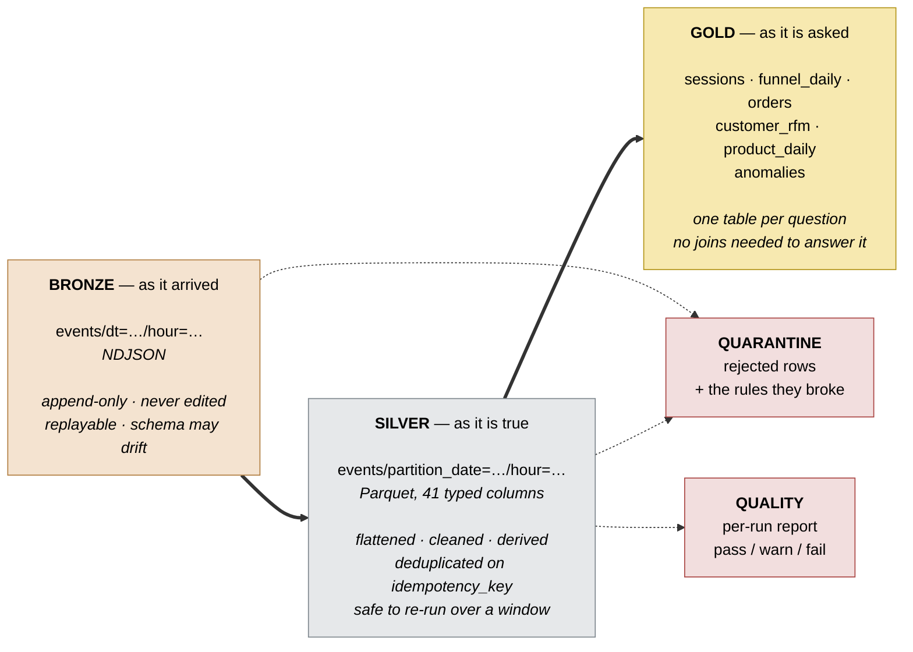
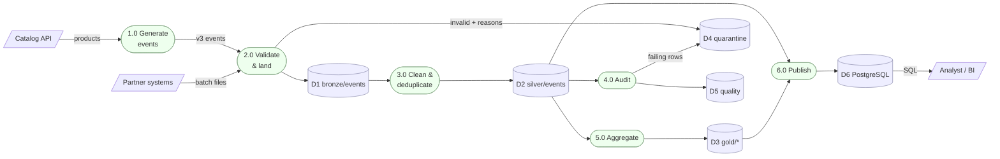
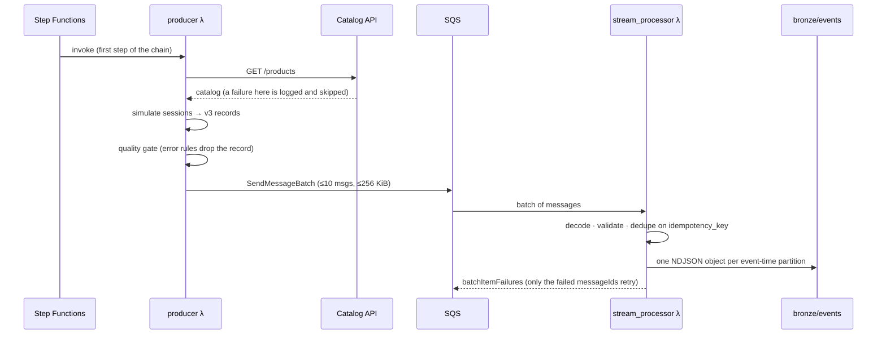
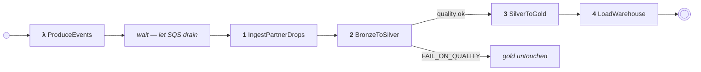

# E-Commerce Lakehouse — 2 sources → medallion data lake → PostgreSQL

The **data engineering code** for a serverless e-commerce pipeline on AWS: two
independent ingestion paths — one streaming, one batch — a medallion data lake
on S3 (bronze → silver → gold), four Glue jobs, quality rules that quarantine a
bad record instead of losing it, and a PostgreSQL warehouse at the end of it.

This repo contains the **scripts and the SQL** — the logic of each stage — not
the infrastructure. Provision the AWS resources with your IaC tool of choice
and wire the names in through `CONFIG_PATH`.



---

## Architecture



### The medallion layers



### Data flow (DFD, level 1)



---

## The two sources

| # | Source | Path into the lake | Why it exists |
|---|--------|--------------------|---------------|
| ① | **Catalog API** (HTTP JSON) | API → `ecommerce_producer` λ → **SQS** → `stream_processor` λ → `bronze/events/` | The streaming path. Two functions and a queue, so a slow consumer, a bad deploy or a traffic spike buffers instead of dropping. The queue is the shock absorber. |
| ② | **Partner file drops** (CSV / NDJSON / JSON) | `landing/partners/` → **Glue job 1** → `bronze/events/` | The batch on-ramp, and a *batch* is why it is a job and not a function: a drop can be ten million rows, which does not fit in a 15-minute Lambda. See [`data/`](data/) for a ready-to-drop sample. |

The two paths meet in `bronze/events/`, in the same v3 shape, carrying the same
`idempotency_key` — so the same business event arriving twice, once queued and
once in a file, deduplicates against itself in silver. Everything downstream is
derived from **behaviour**: the pipeline reads no operational database, so there
is no product cost and no customer record beyond what the events carry.

### What each path costs

| | Latency | Billed per run | Ceiling |
|---|---|---|---|
| ① SQS → Lambda | seconds | fractions of a cent per invocation | 15 min, 10 GB |
| ② file → Glue | until the next run | a **minimum of one minute** of DPU | none that matters |

For a steady trickle of small files, a Lambda would be the cheaper design. This
one is built for files that arrive occasionally and are large when they do.

### ① The streaming path in detail



The producer never loops: the state machine owns the cadence, the function does
one batch and returns. On a `.fifo` queue the schema's `idempotency_key` doubles as
the SQS deduplication id.

---

## The four Glue jobs

| # | Job | In → Out | What it decides |
|---|-----|----------|-----------------|
| 1 | [`glue_landing_ingest.py`](src/jobs/glue_landing_ingest.py) | `landing/partners/` → `bronze/events/` | Lifts a partner's flat CSV into the v3 record — nested blocks, basket arithmetic, and the *same* identity hash the streaming path produces. Ingested files are moved to `landing/_processed/`, so the next run does not re-read them. |
| 2 | [`glue_bronze_to_silver.py`](src/jobs/glue_bronze_to_silver.py) | `bronze/events/` → `silver/events/` | Flatten, clean, derive, deduplicate on `idempotency_key` with a window function — which makes the job **safe to re-run over an overlapping window**. |
| 3 | [`glue_silver_to_gold.py`](src/jobs/glue_silver_to_gold.py) | `silver/` → `gold/` | The six analytical tables — sessions, funnel, orders, RFM, product performance, anomalies. |
| 4 | [`glue_rds_load.py`](src/jobs/glue_rds_load.py) | `silver/` + `gold/` → PostgreSQL | Seven tables, one connection profile, one pass. `overwrite` truncates rather than dropping, so grants and indexes survive. |

Each job takes its own `--CONFIG_PATH`; see [`config/`](config/) for a
commented example per job.

### Why jobs 2 and 3 are separate

Silver is written off a small hourly delta. Gold recomputes windows that span
days. Splitting them lets each run on its own schedule and worker count, and be
retried without redoing the other — and it keeps each script to one layer, which
is what lets both stay self-contained.

### Where the gate lives now

There is no separate audit job. Job 2 scores the batch it just wrote — retention,
duplicates, null rates — into `quality/dt=…/report-*.json`, and `FAIL_ON_QUALITY:
true` in its config makes a breach abort the job. Because Step Functions stops on
that failure, gold and the warehouse keep yesterday's numbers, which are better
than today's wrong ones.

What was lost with the audit job is the *depth* of the check: twelve declarative
rules evaluated row by row against silver, with the offending rows copied to
`quarantine/audit/`. What remains is a batch score and a threshold.

---

## The lake layout

```
s3://<bucket>/
  landing/partners/                        source ② — files exactly as received
  bronze/
    events/dt=YYYY-MM-DD/hour=HH/          sources ① ② — NDJSON, event-time partitioned
  silver/
    events/partition_date=…/hour=…/        Parquet fact table, 41 typed columns
  gold/
    sessions|funnel_daily|orders|customer_rfm|product_daily|anomalies/
  quarantine/
    events/dt=…/hour=…/                    rejected at ingest, with rule names
    audit/dt=…/                            rejected by the batch audit
  quality/dt=…/report-*.json | audit-*.json
```

Pre-medallion configs still work: `RAW_PREFIX`, `PROCESSED_PREFIX`,
`CURATED_PREFIX` and `REJECTED_PREFIX` win over the medallion defaults when
present, so an existing deployment keeps writing exactly where it wrote before.
[`common/lakehouse.py`](src/common/lakehouse.py) owns every path in one place.

### The gold tables

| Dataset | Grain | Notable columns |
|---------|-------|-----------------|
| `sessions` | one browsing session | duration, views, cart_adds, checkouts, orders, `converted`, `bounced`, revenue |
| `funnel_daily` | day × channel | stage counts in **distinct sessions**, `view_to_cart_pct`, `cart_to_checkout_pct`, `checkout_to_order_pct`, `revenue_per_session` |
| `orders` | one order | line_items, units, gross/discount/net, `status` (completed/cancelled/refunded), `realized_revenue` |
| `customer_rfm` | one customer | recency/frequency/monetary quintiles, `rfm_segment`, `refund_rate_pct`, `is_buyer` |
| `product_daily` | day × product | views, cart_adds, units_sold, revenue, `view_to_order_pct`, `revenue_rank` |
| `anomalies` | flagged event | `reasons[]` (high_amount, bulk_quantity, extreme_discount, rapid_fire, anonymous_purchase, …) + `severity` |

Cancellations and refunds carry a **negative** `signed_net_amount`, so net
revenue anywhere downstream is a plain `SUM`.

---

## PostgreSQL

One database, and it sits at the *end* of the pipeline: the analytical
warehouse. [`glue_rds_load.py`](src/jobs/glue_rds_load.py) is the only file that
speaks JDBC.

The connection lives in **one place**: the job's config file, the one Glue hands
it as `--CONFIG_PATH`. `getResolvedOptions` resolves `JOB_NAME` and `CONFIG_PATH`
and nothing else — every `RDS_*` setting is read from the file:

```json
"RDS_HOST": "ecommerce-warehouse.abcdefghijkl.eu-west-3.rds.amazonaws.com",
"RDS_PORT": "5432",
"RDS_DATABASE": "ecommerce",
"RDS_SCHEMA": "analytics",
"RDS_USERNAME": "adminuser",
"RDS_PASSWORD": "",
"RDS_SSLMODE": "require"
```

which becomes:

```
jdbc:postgresql://{RDS_HOST}:{RDS_PORT}/{RDS_DATABASE}?sslmode={RDS_SSLMODE}
```

`RDS_SCHEMA` qualifies any table name that is not already qualified. Anything
left blank is looked up in Secrets Manager when `RDS_SECRET_ARN` is set in that
same file — which is how the password stays out of it. A password written into a
config file on S3 is a password on S3, readable by anything holding
`s3:GetObject` on the bucket. Fine for local development; use the secret for
anything else.

Set the whole file up from
[`config/glue_rds_load.example.json`](config/glue_rds_load.example.json), which
ships every key with the blanks marked. Missing one is not a mystery: the job
stops before Spark starts and prints the file it read and the keys to add to it.

```bash
psql "$RDS_URL" -f sql/warehouse/001_schema.sql      # 7 tables, indexes, two roles
psql "$RDS_URL" -f sql/warehouse/002_views.sql       # v_revenue_daily · v_funnel · v_customer_360 · …
psql "$RDS_URL" -f sql/warehouse/003_upsert.sql      # staging + merge, the replay-safe load path
psql "$RDS_URL" -f sql/warehouse/004_queries.sql     # example analyses, not deployed
```

Notes worth knowing before the first load:

- **`fact_events` has a unique index on `idempotency_key`.** A replayed window
  therefore *aborts* instead of double-counting, because Spark's JDBC writer has
  no `ON CONFLICT`. Replays go through `stg_fact_events` +
  `analytics.merge_fact_events()`.
- **Two roles.** `pipeline_writer` writes, `analytics_reader` reads. A BI tool
  with `UPDATE` on a warehouse is an incident waiting for a Monday.
- **`overwrite` truncates**, it does not drop — the table keeps its column
  types, indexes and grants across every load.

---

## Orchestration



The state machine definition, the SQS event source mapping, the Glue crawler and
the CloudWatch alarms are all in [`config/orchestration/`](config/orchestration/).
They are reference material for your IaC — no code reads them.

There is no EventBridge in this design: the state machine invokes the producer
Lambda itself, so exactly **one** thing needs scheduling from outside instead of
three rules to keep in step. The cost is latency on the partner files — a drop is
picked up on the next run of the chain rather than seconds after it lands.

---

## Layout

```
src/
  common/                  the Lambdas' library, and nothing else
    ecommerce_schema.py    v3 record contract + strict validation + idempotency key
    event_simulator.py     session-based traffic generator
    sources.py             input connectors: inline / S3 JSON / S3 CSV / HTTP API
    quality.py             declarative rule engine + batch reporting
    lakehouse.py           medallion zones — every S3 path, resolved in one place
    metrics.py             CloudWatch custom metrics emitter
  lambdas/
    ecommerce_producer/    source ① — scheduled producer
    stream_processor/      sources ① ② — the landing zone
  jobs/                    one file = one Glue job, standalone
    glue_landing_ingest.py        job 1 — landing → bronze (source ②)
    glue_bronze_to_silver.py  job 2 — bronze → silver
    glue_silver_to_gold.py        job 3 — silver → gold
    glue_rds_load.py              job 4 — → PostgreSQL
sql/warehouse/           warehouse schema, views, upsert path, example queries
config/                  one commented example per component + orchestration/
data/                    sample catalog + a partner export, ready to drop on S3
docs/architecture.svg    the architecture diagram, exportable
tests/                   unit tests, no AWS and no network access
```

---

## Two deployable units, no shared code between them

| | What it is | What ships |
|---|---|---|
| `common/` + `lambdas/` | the Lambda package | one zip per function |
| `jobs/*.py` | four Glue scripts | one `.py` per job, nothing else |

Every Glue script is standalone: the Spark transformations, the lake layout, the
CloudWatch emitter and the JDBC handling are all *in the file*. Upload it to S3,
point the job's *Script path* at it, and you are done — `--extra-py-files` stays
empty. `common/` is the Lambdas' library and is never imported by a job, which
is what keeps it stdlib + boto3 and able to cold-start in 128 MB.

### What that costs, and how it is made safe

Four copies of the lake layout can drift, and a drift is **silent**: the landing
Lambda would keep writing to `bronze/events/` while a job read somewhere else,
and a day of data would simply look missing.

So the copies are pinned. [`tests/test_job_self_containment.py`](tests/test_job_self_containment.py)
asserts, for every job and for four different configs — medallion defaults,
relocated prefixes, a pre-medallion deployment, an explicit S3 override — that
each copy resolves **exactly** the paths `common/lakehouse.py` resolves, and
that no job imports `common/` at all. A divergence fails the build instead of
the pipeline.

The same choice removed one capability: job 1 used to be able to build the gold
tables in the same pass, which would have meant carrying all six builders in two
files. It now stops at silver, and gold belongs to job 3 alone. One job, one
layer.

## Quality

Quality is checked twice, at two different grains — once per record as it lands,
once per batch after silver is written:

| Where | Grain | On failure |
|-------|-------|------------|
| `stream_processor` λ ([`common/quality.py`](src/common/quality.py)) | one queued record | `error` → `quarantine/events/` with the rule names. `warn` → kept, score degraded |
| `glue_bronze_to_silver` job | the batch | a score in `quality/dt=…/report-*.json`; with `FAIL_ON_QUALITY` a breach aborts the job, and Step Functions stops the chain |

Checks are data, not control flow. Adding one is an entry in a list — in the
config, if you would rather not redeploy:

```json
"QUALITY_CHECKS": [
  {"name": "eur_only", "expr": "currency IS NULL OR currency = 'EUR'", "severity": "warn"}
]
```

`expr` is a Spark SQL predicate that is **true when the row is good**, and it is
NULL-safe on purpose: `NULL = 'x'` is NULL, which a naive check would let pass.

Every run writes `quality/dt=…/*.json` with per-check failure counts, null
rates, duplicate rate and a `pass` / `warn` / `fail` verdict.
`FAIL_ON_QUALITY: true` makes a breach abort the job.

---

## Record schema (v3)

```json
{
  "schema_version": "3.0",
  "event_id": "order_placed-sku-1001-2026-06-24T12:00:00+00:00",
  "idempotency_key": "9f2c…",
  "ingested_at": "2026-06-24T12:00:05+00:00",
  "occurred_at": "2026-06-24T12:00:00+00:00",
  "channel": "mobile_app",
  "event_type": "order_placed",
  "session":   { "session_id": "sess-8f3a…", "sequence": 4 },
  "device":    { "type": "mobile", "os": "ios", "user_agent": "Mozilla/5.0 …" },
  "geo":       { "country": "FR", "city": "Lyon" },
  "product":   { "product_id": "sku-1001", "sku": "SKU-1001", "name": "Wireless Mouse",
                 "category": "electronics", "brand": "Acme", "price": 49.99 },
  "customer":  { "customer_id": "cust-00042", "segment": "loyal", "country": "FR",
                 "is_returning": true },
  "order":     { "order_id": "ord-3c1b…", "quantity": 2, "unit_price": 49.99,
                 "discount_pct": 10.0, "gross_amount": 99.98, "discount_amount": 10.0,
                 "net_amount": 89.98, "amount": 89.98,
                 "currency": "EUR", "payment_method": "card" },
  "marketing": { "campaign": "spring_sale", "source": "google", "medium": "cpc" }
}
```

`idempotency_key` is a stable hash of the event's business identity — the same
business event hashes identically however many times it is delivered, which is
what makes both the Lambda dedupe and the silver window function work.
`order.amount` is kept as an alias of `net_amount` so v2 consumers keep working.

---

## Getting data in

[`data/`](data/) holds four generated files — a product catalog, a customer
list, and a partner export in both CSV and NDJSON — every row of which was run
through the project's own quality rules before being committed: 89 events, none
rejected.

```bash
aws s3 cp data/catalog/ s3://$OUTPUT_BUCKET/catalog/ --recursive
aws s3 cp data/landing/partner_events.csv s3://$OUTPUT_BUCKET/landing/partners/
```

The second line *is* source ②: the `ObjectCreated` notification wakes the
landing Lambda, which expands the file and writes it to `bronze/events/`.

---

## Running the tests

```bash
pip install -r requirements-dev.txt
pytest
```

389 tests, no AWS and no network access: boto3 clients are mocked or stubbed,
the JDBC layer is exercised through fake writers, and the Spark tests spin up a
local `SparkSession`. Those **skip** rather than fail when PySpark is absent, so
the suite still runs in a bare environment. On Windows the filesystem
round-trip tests also skip unless `winutils.exe` is present — a
Hadoop-on-Windows requirement, not a code issue.

---

## Notes

- **Cost choices baked into the code**: batched SQS sends, NDJSON landing,
  event-time partitioning, Parquet with `COALESCE` against the small-files
  problem, partial-batch Lambda responses, incremental `PROCESS_DATE` runs, and
  batched JDBC inserts.
- **Glue packaging**: each job script is standalone, so `--extra-py-files` is
  empty. That also side-steps the classic Glue trap — bundling
  `boto3`/`botocore` shadows the versions Glue ships and causes
  `DataNotFoundError: Unable to load data for: endpoints`.
- **IAM, minimum viable**: producer λ — `sqs:SendMessage`, `s3:GetObject` on the
  config and any S3 catalog, `cloudwatch:PutMetricData`. Landing λ —
  `s3:GetObject` on `landing/`, `s3:PutObject` on `bronze/` and `quarantine/`,
  SQS consume. Glue jobs — `s3:*Object` on the lake and
  `secretsmanager:GetSecretValue` on the warehouse secret.
